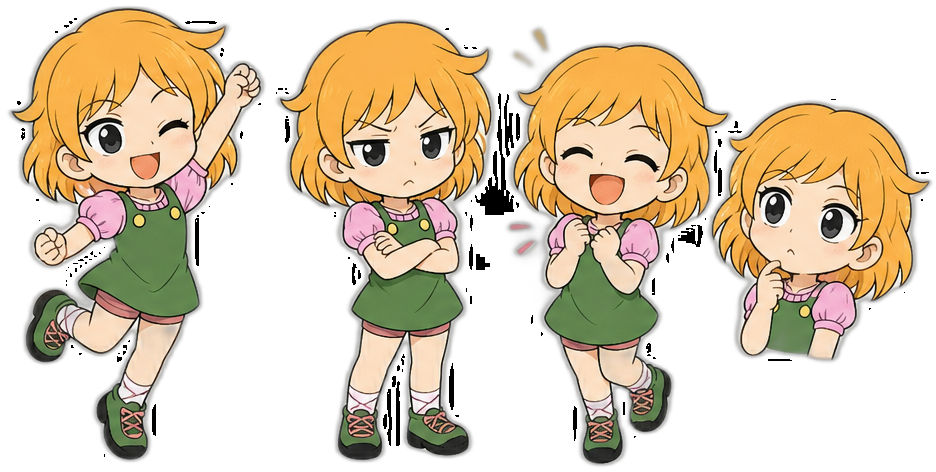

# Quitar Fondo y Separar Objetos

Este script recibe una imagen, elimina el fondo y genera un archivo PNG por cada objeto detectado.

## Uso

1. Instala las dependencias:

```bash
pip install -r requirements.txt
```

2. Ejecuta el script:

```bash
python remove_background_objects.py "<IMAGEN>" --output-dir resultados --save-full
```

3. Las imágenes resultantes se guardarán en `resultados/`.



## Notas

- El script usa `rembg` para eliminar el fondo de manera más precisa.
- Si `rembg` no está instalado o no tiene backend ONNX disponible, usa `OpenCV` con `grabCut` como respaldo.
- Si tienes CUDA y `onnxruntime-gpu`, el script detecta la GPU y recomienda usar esa aceleración.
- Para instalar `rembg` en CPU:
  ```bash
  pip install "rembg[cpu]"
  ```
- Para usar GPU con CUDA, instala `rembg[gpu]` y asegúrate de tener `onnxruntime-gpu`.
- El procesamiento limpia componentes alfa desconectados y luego recorta solo objetos conectados entre sí.
- Añade filtros de tamaño para descartar objetos muy pequeños con `--min-width` y `--min-height`.
- Cada objeto separado se guarda con nombre `*_object_1.png`, `*_object_2.png`, etc.
- Repositorio de referencia: https://github.com/CarlosNaranjoMx/StickersMaker
